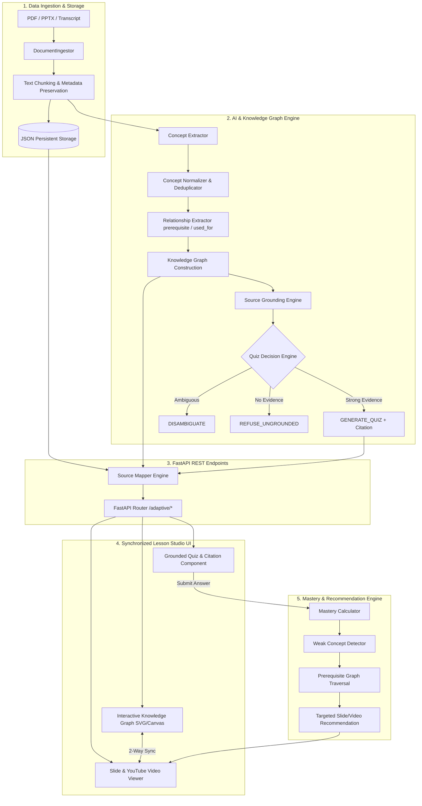

# Mini Hackathon AI — Batch 04 · Lớp 3A

**SPEC → Prototype → Demo.** Đây không phải cuộc thi code — đây là cuộc thi **tư duy sản phẩm AI**.

## 👥 Thành viên nhóm & Phân công vai trò

**Lớp:** 3A · **Phòng:** E402 · **Cụm:** C2 · **Track:** Track C — Lesson Studio

| Họ và Tên | Mã Học Viên | Vai trò chính | Phần việc đảm nhiệm trong dự án |
|---|---|---|---|
| Nguyễn Đức Anh | 2A202602508 | Leader / AI Lead | Điều phối dự án, kiến trúc AI & Knowledge Graph: Concept Extraction, Relationship Extraction, Source Grounding, Grounded Quiz, Prompt Engineering, Golden Set và AI Evaluation. |
| Nguyễn Như Tài | 2A202602976 | Backend & Data Engineer | Phụ trách Data Ingestion (PDF, PPTX, Transcript), Chunking & Metadata, SQLite/JSON Storage, RESTful FastAPI APIs, và bộ công cụ Source Mapper 2 chiều (Slide/Timestamp ↔ Concept). |
| Lò Văn Long | 2A202602541 | Frontend UX Engineer | Thiết kế giao diện Lesson Studio UI, Slide Viewer, Video Viewer (YouTube Sync), Knowledge Graph canvas (SVG/D3.js), đồng bộ 2 chiều Slide/Video ⇄ Graph, Citation UI và Lecturer Review UI. |
| Nguyễn Công Vinh | 2A202602519 | Fullstack & Adaptive Engineer | Phụ trách tích hợp Frontend–Backend, tính toán Concept Mastery, thuật toán duyệt đồ thị tìm Prerequisite, đề xuất lộ trình ôn tập thích ứng (Adaptive Recommendation), và Integration/E2E testing. |

---

<div align="center">

# 🎓 SilentVoix — Lesson Studio
### *Synchronized Knowledge Graph, Anti-Hallucination Grounded Quiz & Adaptive Learning*

[](https://www.python.org/)
[](https://fastapi.tiangolo.com/)
[](./tests/)
[](./eval/)
[]()

</div>

---

## 💡 1. Tổng Quan & Vấn Đề Cần Giải Quyết (Problem & JTBD)

### 📌 Vấn đề thực tế (Problem Statement)
Tài liệu học tập (Slide, PDF, Transcript Video) thường được trình bày dạng **tuyến tính** theo trang hoặc timeline. Điều này tạo ra hai nhóm khó khăn lớn:

1. **Phía Học viên:**
   - **88.9%** (8/9 học viên khảo sát) gặp khó khăn trong việc xác định mối quan hệ phụ thuộc giữa các khái niệm.
   - Khi làm sai quiz, học viên không biết chính xác **kiến thức nền (prerequisite)** nào đang bị hổng.
   - Tốn nhiều công sức để truy ngược đáp án hoặc khái niệm về đúng trang Slide / giây Video gốc (**87.5%** coi đây là pain point lớn nhất).
2. **Phía Giảng viên:**
   - Tốn thời gian tổ chức kiến thức dạng sơ đồ, soạn câu hỏi kiểm tra và đảm bảo 100% nội dung câu hỏi có thể kiểm chứng (grounded) từ tài liệu gốc.

### 🎯 Giải pháp SilentVoix (Core JTBD)
SilentVoix chuyển đổi tài liệu thô (PDF, PPTX, Video/Transcript) thành một **Lesson Studio tương tác**:
- **Đồng bộ tri thức 2 chiều (2-Way Sync):** Slide/Video phát tới đâu, Node khái niệm tương ứng trên Knowledge Graph tự động sáng tới đó (và ngược lại).
- **Bộ máy sinh Quiz chống hallucination (Tri-state Engine):** Chỉ tạo câu hỏi khi có bằng chứng rõ ràng (`GENERATE_QUIZ`), chủ động yêu cầu làm rõ khi thông tin nhập nhằng (`DISAMBIGUATE`), và **từ chối sinh câu hỏi** khi tài liệu không chứa kiến thức (`REFUSE_UNGROUNDED`).
- **Học tập thích ứng (Adaptive Recommendation):** Khi học viên làm sai quiz $\to$ hệ thống tự động suy ra khái niệm yếu $\to$ duyệt đồ thị tìm kiến thức nền tiên quyết (Prerequisite) $\to$ điều hướng học viên về đúng trang Slide / giây Video cần ôn tập.

---

## ⭐ 2. Tính Năng Nổi Bật (Key Features)

```text
               Nguồn Tài Liệu (PDF / PPTX / Transcript)
                                 │
                                 ▼
                     KNOWLEDGE GRAPH ENGINE
                     /         │        \
                    /          │         \
      Đồng Bộ 2 Chiều   Quiz Grounded   Học Thích Ứng
            │                  │               │
            ▼                  ▼               ▼
     Slide / Video ⇄ Graph   Citation        Prerequisite
      (Navigation)         (Traceability)  (Recommendation)
```

1. **Synchronized Knowledge Graph (Slide/Video ⇄ Graph):**
   - Click vào Node khái niệm $\to$ Viewer tự động tua đến đúng trang Slide hoặc mốc thời gian Video chứa kiến thức.
   - Xem Slide/Video $\to$ Graph tự động highlight khái niệm đang được giảng dạy.
2. **Tri-State Anti-Hallucination Engine:**
   - `GENERATE_QUIZ`: Sinh quiz kèm Citation (trích dẫn nguồn trang/giây).
   - `DISAMBIGUATE`: Trả về ngữ cảnh làm rõ khi tài liệu có nhiều cách hiểu.
   - `REFUSE_UNGROUNDED`: Từ chối trả lời hoặc sinh quiz cho câu hỏi nằm ngoài tài liệu cung cấp.
3. **Adaptive Learning & Prerequisite Traversal:**
   - Tính điểm năng lực **Concept Mastery** theo trọng số lịch sử làm bài.
   - Khi phát hiện khái niệm yếu (Mastery < 0.5), hệ thống dùng thuật toán đồ thị tìm khái niệm tiên quyết cần học trước và tạo link khuyến nghị trực tiếp.
4. **Augment Lecturer Review Workflow (Human-in-the-Loop):**
   - Giảng viên có quyền **Approve / Edit / Reject** các khái niệm và câu hỏi do AI bóc tách trước khi xuất bản lesson cho học viên.

---

## 🏗️ 3. Kiến Trúc Hệ Thống (Architecture & Data Flow)



---

## 💻 4. Công Nghệ Sử Dụng (Tech Stack)

| Phân hệ | Công nghệ sử dụng | Mô tả chức năng |
|---|---|---|
| **Backend & API** | Python 3.12.10, FastAPI, Uvicorn, Pydantic v2 | Xây dựng RESTful API server, quản lý data contracts & async endpoints. |
| **Ingestion & Storage** | PyPDF, Python-PPTX, JSON Storage | Bóc tách text & metadata từ PDF/PPTX/Subtitle, lưu trữ kiên cố dữ liệu. |
| **AI & Graph Engine** | Custom Pipeline (`ai/pipeline.py`), NetworkX | Trích xuất khái niệm, quan hệ đồ thị, deduplication và kiểm tra tính hợp lệ. |
| **Frontend UI** | HTML5, CSS3 Vanilla, JavaScript ES6+, SVG Canvas | Giao diện Lesson Studio, vẽ đồ thị tương tác (Zoom/Pan), đồng bộ 2 chiều. |
| **Testing & Evaluation** | PyTest, Custom Evaluation Suite (`eval/`) | Chạy unit test backend, kiểm thử đồ thị và đánh giá AI trên Golden Set. |

---

## 📡 5. Danh Sách REST APIs (`/adaptive/...`)

| HTTP Method | API Endpoint | Mô tả chức năng |
|---|---|---|
| `POST` | `/adaptive/documents/upload` | Upload file tài liệu thật (`.pdf`, `.pptx`) từ máy tính. |
| `POST` | `/adaptive/lessons/video` | Khởi tạo lesson từ URL Video (YouTube / MP4). |
| `POST` | `/adaptive/lessons/slide` | Khởi tạo lesson từ URL Slide / Google Docs công khai. |
| `GET` | `/adaptive/lessons/{lesson_id}` | Lấy chi tiết thông tin bài giảng và danh sách slide. |
| `GET` | `/adaptive/knowledge-graph/{lesson_id}` | Trả về cấu trúc đồ thị tri thức (Nodes & Edges) dạng JSON. |
| `GET` | `/adaptive/concepts/by-slide/{slide_number}` | Ánh xạ từ số trang Slide $\to$ Danh sách Concept tương ứng. |
| `GET` | `/adaptive/concepts/by-time/{timestamp}` | Ánh xạ từ giây Video $\to$ Concept đang giảng. |
| `POST` | `/adaptive/quiz/answer` | Nộp câu trả lời quiz, tính toán và lưu điểm Concept Mastery. |
| `GET` | `/adaptive/recommendation/{student_id}` | Trả về gợi ý trang Slide / giây Video cần học lại dựa trên hổng kiến thức nền. |
| `GET` | `/adaptive/mastery/{student_id}` | Báo cáo bảng điểm năng lực tất cả các khái niệm của học viên. |

---

## 🚀 6. Hướng Dẫn Cài Đặt & Chạy Dự Án (Quickstart)

### Bước 1: Clone Repository & Tạo môi trường ảo
```bash
git clone https://github.com/YourRepo/K4-3A-E402-SilentVoix.git
cd K4-3A-E402-SilentVoix

# Tạo môi trường ảo Python 3.12
python -m venv .venv

# Kích hoạt môi trường ảo (Windows PowerShell)
.\.venv\Scripts\Activate.ps1
```

### Bước 2: Cài đặt Dependencies
```bash
pip install -r requirements.txt
```

### Bước 3: Chạy Backend API Server
```bash
python -m uvicorn adaptive_learning.api:adaptive_router --reload --port 8000
```
- Truy cập Swagger API Docs tại: `http://127.0.0.1:8000/docs`

### Bước 4: Mở Giao diện Frontend UI
- Trực tiếp mở file [`index.html`](file:///d:/vinuni%20AI/hackathon/K4-3A-E402-SilentVoix/index.html) bằng trình duyệt web (hoặc sử dụng VSCode Live Server).

---

## 🧪 7. Kết Quả Kiểm Thử & Evaluation (Verification Results)

Hệ thống đã trải qua các bộ test toàn diện về cả **phần mềm (Software Correctness)** lẫn **chất lượng AI (AI Evaluation)**:

```powershell
# 1. Chạy pytest cho AI Pipeline (13 passed)
pytest tests/

# 2. Chạy Backend Module Unit Tests (5/5 passed)
python eval/test_be_modules.py

# 3. Chạy Evaluation Suite 26 Cases Golden Set (26/26 passed)
python eval/run_eval.py
```

### 📊 Bảng tổng hợp kết quả Benchmark:

| Bộ kiểm thử / Metric | Số lượng test | Kết quả | Ghi chú nghiệm thu |
|---|---:|:---:|---|
| **Software Core PyTest** | 13 tests | **13/13 PASSED (100%)** | Đã kiểm thử trích xuất, dedup, quan hệ & quiz decision. |
| **Backend Modules Test** | 5 suites | **5/5 PASSED (100%)** | Ingestion, Source Mapper, Storage, Quiz & Recommendation APIs. |
| **Backend Eval Suite** | 26 cases | **26/26 PASSED (100%)** | Mastery, State, Traversal, Integrity, Groundedness, Sync. |
| **Source Traceability** | 22 cases | **22/22 PASSED (100%)** | Metadata nguồn chính xác 100% đến từng slide/timestamp. |
| **Anti-Hallucination Refusal**| 22 cases | **22/22 PASSED (100%)** | Từ chối tuyệt đối 100% các yêu cầu kiến thức ngoài tài liệu. |

---

## 📁 8. Cấu Trúc Thư Mục Dự Án (Repository Layout)

```text
K4-3A-E402-SilentVoix/
├── README.md                  ← File giới thiệu tổng quan dự án & hướng dẫn
├── TEAMATES.md                ← Báo cáo phân công vai trò & đóng góp thành viên
├── TEAMMATES.md               ← File alias đồng bộ
├── spec.md                    ← Bản AI Spec chuẩn chi tiết của nhóm
├── index.html                 ← Giao diện chính Lesson Studio UI
├── requirements.txt           ← Danh sách thư viện Python phụ thuộc
├── .env.example               ← Template cấu hình môi trường
│
├── adaptive_learning/         ← Phân hệ Backend & Adaptive Learning Engine
│   ├── api.py                 ← FastAPI Router chứa 10+ endpoints
│   ├── ingestion.py           ← Module bóc tách PDF, PPTX & Transcript
│   ├── source_mapper.py       ← Engine tra cứu 2 chiều Slide/Timestamp ↔ Concept
│   ├── storage.py             ← Quản lý lưu trữ kiên cố data/storage.json
│   ├── models.py              ← Định nghĩa Pydantic Schemas
│   ├── mastery.py             ← Thuật toán tính điểm năng lực học viên
│   └── graph.py               ← Thuật toán duyệt đồ thị tìm Prerequisite
│
├── ai/                        ← Phân hệ AI & Knowledge Graph Core
│   ├── pipeline.py            ← Entry point xây dựng đồ thị & quiz
│   ├── extraction/            ← Concept Extractor, Normalizer & Relation Extractor
│   ├── graph/                 ← Validator kiểm tra đồ thị hợp lệ
│   ├── quiz/                  ← Generator câu hỏi với tri-state decision
│   └── grounding/             ← Engine kiểm tra evidence & citation
│
├── fe/                        ← Frontend Assets & Interactive Scripts
│   ├── scripts/               ← app.js, graph.js, video-player.js, quiz.js
│   └── styles/                ← main.css styling
│
├── eval/                      ← Bộ công cụ kiểm thử & Đánh giá AI
│   ├── golden_set.json        ← Bộ dữ liệu mẫu chuẩn (Golden Set)
│   ├── test_be_modules.py     ← Unit tests cho các module Backend
│   ├── run_eval.py            ← Evaluation runner cho backend & graph
│   └── run_e2e_eval.py        ← End-to-end evaluation runner
│
└── tests/                     ← Software Unit Tests (PyTest)
    ├── test_ai_pipeline.py    ← Test suite cho AI pipeline
    └── golden/                ← Test case JSON fixtures
```

---

<div align="center">

**Dự án được xây dựng bởi Nhóm K4-3A-E402-SilentVoix — Mini Hackathon AI Batch 04**

</div>